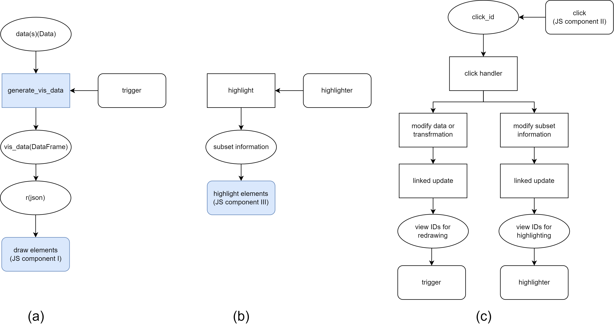

NNVisBuilder is a toolkit used to quickly prototype interactive visual analysis interfaces for neural networks. The interface built with NNVisBuilder is organized in views. Views are bound to data, and when the bound data changes, the views change accordingly. Developers can define interactions on views and modify the values of data within the interactions to achieve different interaction effects. NNVisBuilder mainly includes the implementation of three modules (Here we introduce the toolkit from the perspective of the code files, which is different from the approach in the paper.): the builder module, the data module, and the view module. The builder module is used to obtain data related to neural networks. The data module defines the tensor data class and various transformation classes on data. The view module contains the definitions of different views.

- [Builder Module](#builder-module)
- [Data Module](#data-module)
  - [Type](#type)
  - [Data](#data)
  - [Data Transformation](#data-transformation)
    - [Rule (Base Class)](#rule-base-class)
    - [Filter](#filter)
    - [Aggregation](#aggregation)
    - [Transpose](#transpose)
    - [Reshape](#reshape)
    - [OtherTransform](#othertransform)
- [View Module](#view-module)
  - [View (Base Class)](#view-base-class)
  - [Implementation \& Customized View](#implementation--customized-view)
    - [Implementation](#implementation)
    - [Backend View Functions](#backend-view-functions)
    - [Customized View](#customized-view)
  - [Built-in Views](#built-in-views)
    - [ScatterPlot](#scatterplot)
    - [Gallery](#gallery)
    - [HeatMap](#heatmap)
    - [SentenceList](#sentencelist)
    - [TextView](#textview)
    - [ParallelCoordinate](#parallelcoordinate)
    - [BarChart](#barchart)
    - [PointChart](#pointchart)
    - [LinkMap](#linkmap)
    - [Other View Classes](#other-view-classes)
    - [Widget](#widget)
  - [Classes for Highlighting](#classes-for-highlighting)
    - [Highlighter](#highlighter)
    - [MultiHighlighter](#multihighlighter)


# Builder Module

When building prototypes for visual analysis interfaces for neural networks, various types of data are used, mainly including network activations (also known as embedding, hidden layers, or the output of layers) and parameters, input, training metrics, and so on. Inputs, training metrics, and other complex data are usually held by the user. The builder module can be used to retrieve data related to the network.

The builder module includes a `Builder` class to wrap the model. The activations and parameters of the model can be obtained through a `Builder` object. `Builder` accesses the connection data directly through the model and obtains activation data by adding Pytorch hooks. `Builder` is also responsible for building and launching the interface. All defined views will be stored in the class variables of `Builder`. `Builder` will parse these views and generate the corresponding front-end code when launching the interface.

- key variables
  - `model`: The model.
  - `embeddings`: A `Dict`, where the keys are the names of the network layers and the values are the activations(output) corresponding to that layer in stage 0.
  - `embeddings_1`: A `Dict`, where the keys are the names of the network layers and the values are the activations(output) corresponding to that layer in stage 1.
  - `embeddings_g`: A `Dict`, where the keys are the names of the network layers and the values are the activations(output) of the grid data corresponding to that layer.
  - `connections`: A `Dict`, where the keys are the names of the network layers and the values are the weights corresponding to that layer.
  - `name2module`: A `Dict`, the result of `dict(model.named_modules())`. Based on this variable, the parameters of the network can be modified.
- `def __init__(self, model, input_=None):`
  Constructor, `model` is the model to be wrapped. If the `input` is specified, then NNVisBuilder will automatically pass `input` to the `model` when `run` is called later.
- `def add_hiddens(self, layers, cat_dim=0, component=None, stage=0, activate=True):`
  After calling this function, NNVisBuilder generates hooks for the specified network layers for recording the activations of these layers later.
  - `layers`: The names of the network layers whose hidden layers need to be recorded. This parameter can be a `str` or `list`.
  - `cat_dim`: The input dimension arrangement for different network layers may be different, for example, some outputs may have the pattern `(batch_size, hid_dim)`, while others may have `(hid_dim, batch_size)`. We usually want to concatenate them along the `batch_size` dimension when multiple batches of samples are input to the model. This parameter allows the user to specify the dimension for concatenation.
  - `component`: The output of some network layers may not be a PyTorch tensor, for example, a tuple of tensors in some layers of an RNN network. `component` allows the user to specify how to extract the tensor from the output of the network layer. For example, defining `component` as the following lambda function `lambda x: x[0]`, indicates that the first tensor in the output tuple should be extracted. NNVisBuilder provides some templates, such as specifying the `component` as `rnn` is equivalent to specifying it as `lambda x: x[0]`.
  - `stage`: NNVisBuilder divides the recording of hidden layers into two stages, stage 0 and stage 1, which represent before and after the interface is launched (i.e., before and after the `run` is called), respectively. For example, when a user needs to input a sentence on the interface and then pass it into the model to observe the embedding of a certain layer, they can specify the stage as 1. The reason for distinguishing the stages is that recording hidden layers usually consumes a lot of memory, and sometimes the layers that need to be recorded in stage 1 do not need to be recorded in stage 0. By limiting the stage, memory can be saved. If the user specifies the stage as "all", NNVisBuilder will record the hidden layers of both stages.
  - `activate`: If it is `True`, the generated hooks will be registered at the same time. This will automatically record the hidden layers to the corresponding key in `embedding` when input is passed to `model` any time later. If it is `False`, the hooks need to be activated later to record the activations.
- `def add_connects(self, layers):`
  NNVisBuilder will allocate a position in the `connections` for the specified layer, and each subsequent call to `record_connects` will record the weights of the corresponding layer. The meaning of `layers` is the same as `add_hiddens`.
- `def activate_hooks(self):`
  Activate the hooks of stage 0 generated by `add_hiddens`. If `activate` in `add_hiddens` is set as `True`. If it is true, then the user usually does not need to call this function.
- `def deactivate_hooks(self):`
  Deactivate the hooks of stage 0 generated by `add_hiddens`. The user usually does not need to call this function. NNVisBuilder will automatically call it before launching the interface to save memory.
- `def run(self, file_name='templates/index.html', batch_size=64, foward_manual=True, auto_open=False):`
  Launch the interface.
  - `file_name`: The location of the generated HTML file.
  - `batch_size`: Specifies the batch size of the `input` passed to the `model`. This parameter is valid when `fowward_mannal` is `False`.
  - `fowward_mannal`: When it is `False`, NNVisBuilder will automatically pass the input to the model. If the `input` does not support the direct form `model.forward(input)`, such as in an RNN model, the user can complete this part (which is already included in the user's learning code) and specify it as `True`.
  - `auto_open`: Whether to automatically open the generated interface in the browser.
- `def generate_grid_data(self):`
  Generate grid data based on the range of the input (used to observe decision boundaries).
- `def add_hidden_grid(self, layers):`
  Specify the layers for which the embedding needs to be recorded for the grid data.
- Other functions no need to be called by developers.

# Data Module

The data module mainly contains a `Data` class and many Transformation classes.

## Type

An enumeration class used to represent the order of a tensor. In addition to `Scalar`, `Vector`, and `Matrix` representing their original meanings, we use `Tensor3`, `Tensor4`, etc. to represent higher-order tensors.

## Data

NNVisBuilder considers the data used in the visualization process as tensors and uses `Data` class to represent tensors. The user can wrap the obtained data (including activations and parameters in the builder, as well as other data prepared by the user) in the `Data` class as needed. Usually, if the user needs to dynamically modify associated data and views when the data is modified, they can wrap the data in a `Data` class.

- key variables
  - `type`: The order of the tensor, with a value from the possible values of `Type`.
  - `value`: The value of the data, which NNVisBuilder will uniformly convert to a `numpy.ndarray`.
  - `views`: The associated views.
  - `rules`: The associated transformations.
  - `name_filters`: A `Dict` that stores the mapping between the filter name (if specified) and the corresponding `Filter`.
- `def __init__(self, value=None, data_type=None):`
  Constructor, the developers can directly wrap data or specify a data type to generate a `Data` object. If the developers specify `value`, the `type` will be automatically determined.
- `def update(self, value, flag=True):`
  Modify the `value` and execute the transformations saved in `rules` to modify associated data. The execution of these transformations will cause the update of the data at the end of the transformation, thus completing the update of all associated data in a depth-first search manner. If `flag` is `True`, these transformations will be executed immediately. Otherwise, these transformations will be executed automatically when the associated data is needed. The `views` associated with the data will also be recorded in `View.update_list` for redrawing.
- `def filter(self, dim=0, filter_type=Type.Scalar, name=None, value=None):`
  Generate a `Filter` object and bind it to the data (save to `rules`). The role of `dim`, `filter_type`, and `value` can be found in the Filter section. If `name` is specified, the mapping between `name` and the filter will be stored in `name_filters`, and the filter can be accessed later through `data.name_filters(name)`. Return the generated filter and the same function is supported on `Filter` and other transformations, thus facilitating the definition of a series of transformations in a chained manner (`data.filter(...).filter(...).aggregation(...)`).
- `def aggregation(self, dim=0, op='sum'):`
  Similar to the above.
- `def reshape(self, shape=(-1,)):`
  Similar to the above.
- `def other_transform(self, f):`
  Similar to the above.
- `def apply_transform(self, t, dim=-1, name=None, flag=True):`
  Bind transformation `t` to the data.
  - `dim`: If `dim` is not -1, `dim` will override the default `dim` of the transformation. This feature allows the same transformation to be applied to different dimensions of different data.
  - `name`: If `t` is a filter and `name` is specified, the mapping between `name` and the filter will be stored in `name_filters`.
  - `flag`: If it is true, the transformation will be executed immediately, otherwise it will be executed when needed.
- `def save_img(self, ids, prefix=''):`
  Save the data as an image with file name `f'{prefix}-{ids}.png'`, to facilitate passing images to the frontend through paths.
- Utility functions: These functions are commonly used in practice, and NNVisBuilder have provided simple encapsulations to make them easier for developers to use.
  - `def value_(self):` Return `value`.
  - `def size(self):` Return `value.shape`.
  - `def __len__(self):` Return `len(value)`.
  - `def __getitem__(self, index)` & `def __setitem__(self, index, value):` Index Operator Function
  - `where(self, x):` Find all points that equals to `x` (in `value`).
  - `def where_range(self, a, b):` Find all points that greater than `a` and less than `b`.
  - `def nearest_k(self, idx, dim=0, k=10, dist=np.linalg.norm):` Calculates the k nearest points to the idx-th point in dimension `dim`.
  - `def find_all(self, f, dim=0):` Find all points that satisfy `f` in dimension `dim`.
  - `def tolist(self):` Return `value.tolist()`. Converts `numpy.ndarray` to a `list` make it able to be serialized to JSON.

## Data Transformation

All transformation classes can act on `Data` objects, and NNVisBuilder will record the relationship between data and transformations to facilitate subsequent linked updates.

### Rule (Base Class)

All transformation classes inherit from this class.

- key variables
  - `source_data`: A list of all the data that the transformation acts on.
  - `dim`: The default dimension that the transformation acts on (if not specified separately.)
  - `dims`: A list of dimensions that the transformation actually acts on with respective to `source_data`.
  - `result_data`: A list of the resulting data produced by the transformation with respect to `source_data`.
- `def __init__(self, dim=0, data=None):`
  Constructor, when defining transformations, developers can specify the default dimension or the data to be acted upon. Generally, when the user calls `data1.filter` and so on, the NNVisBuilder system will pass `data1` to the parameter to call this constructor. Otherwise, developers do not need to specify `data`.
- `def data(self):`
  Return `result_data[0]`. This function is particular for returning data after defining a series of transformations. Such as `data1 = data.filter(...).aggregation(...).filter(...).data()`.
- `def filter(self, dim=0, filter_type=Type.Scalar, name=None, value=None):`
  Similar to the function `filter` in `Data`.
- `def aggregation(self, dim=0, op='sum'):`
  Similar to the above.
- `def reshape(self, shape=(-1,)):`
  Similar to the above.
- `def other_transform(self, f):`
  Similar to the above.
- `def generate_result(self, data, flag=True):`
  Create a `Data` object for the result, if `flag` is `True`, `apply_i` will be called to compute the value of the generated data. All classes that inherit from `Rule` need to implement this method. For example, `Filter` creates the result data object based on its own type and the type of the source data. If the source data is `Type.Matrix` and the filter itself is `Type.Scalar`, then a `Type.Vector` result data will be created. This function will not be introduced in the subclasses later.
- `def apply_i(self, i, flag=True):`
  Compute the result for the `i`th `source_data`. All classes that inherit from Rule need to implement this method. For example, the `Aggregation` class aggregates the source data according to particular dimension and updates the result data object with the calculated value.
- Other functions no need to be called by developers or be implemented by the subclass.

### Filter

- Variables specific to this subclass:
  - `filter_type`: Similar to `type` in `Data`. Currently, there are three possible values: `Type.Scalar`, `Type.Vector` and `Type.Matrix`.
  - `filter_value`: The value of filter. For example, if the `filter_value` is `[0, 2, 4]`, and it acts on a `(5, 5)` matrix data `a` on dimension 1, then the result is a `(5, 3)` matrix, where columns equal to `a[:, 0]`, `a[:, 2]`, `a[:, 4]` respectively.
- `def __init__(self, dim=0, filter_type=None, value=None):`
  Constructor. `dim` represents the default dimension the filter acts on. `filter_type` represents the type, and `value` represents the initial value. Only one of these two parameters needs to be specified.
- `def update(self, value, flag=True):`
  Similar to `Data`, update the `filter_value` and update datas saved in `result_data` accordingly. Specifically, if `filter_value` is `Type.Vector` and `value` is `Type.Scalar`, NNVisBuilder will decide to remove or add `value` to `filter_value` based on whether value is already in `filter_value`.
- `def apply_i(self, i, flag=True):`
  Compute the result based on `filter_value`: `Type.Scalar` represents extracting a single point at a specific dimension, `Type.Vector` represents extracting a list of points. `Type.Matrix` is usually not used. If the filter is `Type.Matrix`, its value is a matrix composed of specific coordinates. When it is applied to data, the values corresponding to these coordinates will be extracted and combined into a matrix data as the result. The associated data of the result data will also be updated immediately if `flag` is `True`. Otherwise, they will be updated when needed.
- `def value_(self):`
  Return `filter_value`.
- `def __getitem__(self, index):`
  Index Operator Function

### Aggregation

- Variables specific to this subclass:
  `op`: Aggregation operations, which currently include four types: `sum`, `avg`, `max`, and `min`.
- `def __init__(self, dim=0, op='sum'):`
  Constructor, similar to `Filter`.
- `def apply_i(self, i, flag=True):`
  Calculates the sum, average, maximum, or minimum of the specified `op` and dimension. The associated data of the result data will also be updated immediately if `flag` is `True`. Otherwise, they will be updated when needed.

### Transpose

- No variables specific to this subclass.
- `def __init__(self):`
  Constructor.
- `def apply_i(self, i, flag=True):`
  Transpose a `Matrix` data.

### Reshape

- Variables specific to this subclass:
  `shape`: The target shape.
- `def __init__(self, shape=(-1,)):`
  Constructor, similar to `Filter`.
- `def apply_i(self, i, flag=True):`
  Reshape the data based on `shape`. The associated data of the result data will also be updated immediately if `flag` is `True`. Otherwise, they will be updated when needed.

### OtherTransform

Developers can perform any complex and holistic transformations on data base on this class.

- Variables specific to this subclass:
  `f`: The transformation function.
- `def __init__(self, f):`
  Constructor, similar to `Filter`.
- `def update(self, f, flag=True):`
  Similar to `update` in `Filter`.
- `def apply_i(self, i, flag=True):`
  Perform `result_data[i].value = f(source_data[i].value)`. The associated data of the result data will also be updated immediately if `flag` is `True`. Otherwise, they will be updated when needed.

# View Module

The view is the basic unit for constructing interfaces in NNVisBuilder. In NNVisBuilder, views refer to some commonly used charts when building visual analysis interfaces, including scatter plots, line charts, parallel coordinate plots, galleries, etc. These views are composed of basic elements such as points, lines, and images. NNVisBuilder provides a rich set of view types, which can usually meet the needs of developers to build interfaces. If developers have special view requirements, they can also customize views by extending the base view class. After calling `builder.run()`, `Builder` will convert the defined views into frontend code and combine them into an HTML file. Interactions can be defined on the view. The view module also includes a `Highlighter` class that is related to interactions.

## View (Base Class)

All view classes inherit from this class. In this part, we will introduce some functions that developers usually need to use (by calling them in subclasses).

- key variables
  - `update_list`(class variable): A list that stores the idx of views to be redrawn.
  - `highlight_list`(class variable): A list that stores the idx of views to be highlighted.
  - `idx`: The index of view view used to distinguish different views.
  - `position`: The position of the view.
  - `size`: The size of the view.
  - `title`: The title of the view, which will be displayed above the view.
  - `data`: In general, a view needs to be bound to at least one data. Therefore, we define a data variable in the base class. If subclasses need more data, they can define them additionally in the subclass.
  - `highlighter`: It stores the IDs of the elements that need to be highlighted (subset information) and specifies how the view responds to the subset information. The highlighter will be introduced in more detail in the `Highlighter` section.
  - Other view parameters: `wrap` (whether the view has a rectangle border), `opacity` (the opacity of the view), ...
- `def __init__(self, data, position, size=None, highlighter=None, title=None, border=True, opacity=1):` (Some parameters like `stroke-width` for setting the stroke width of the border are omitted.)
  Constructor. If `data` is not of the `Data` class, NNVisBuilder will automatically wrap it.
- `def set_position(self, position):`
  Modifies the `position` attribute. If the length of parameter `position` is 4, then the `size` attribute will be modified based on the last two values.
- `def align(self, info='', view=None, padding=0):`
  This function returns a four-tuple containing the position and size, which is used for alignment between views. `info` is an `str` that contains the following patterns: if the pattern `right(next, a)` is included, then the x position returned is offset by `a + size[0]` to the right of the current view position (`a` can be negative). If `next` is not specified, the returned position will only be offset by `a`. The pattern `under(next, b)` is similar. If the view parameter is not specified, the size returned is equal to the size of the current view. Otherwise, the returned size will make the distance between the boundary of the new view and the boundary of `view` equal to `padding`.
- `def onclick(self, f):`
  Set the click event handler. When the click event occurs, `f` will be called and the ID of the clicked element will be passed to `f` as the parameter. This ID is not exactly the same for each view type, and we will introduce the subset information for each view subclass separately in the Interaction Section.
  The form of `f` is as follows:

  ```python
  def f(value):
      # value will be the click_id
      ... # compute based on the click_id and some data
      ... # modify data or transformations
      ... # modify subset information of highlighters
  ```

- `def on_brush(self, f):`
  Similar to the above. When the brush event occurs, `f` will be called.
- Other functions no need to be called by developers.

## Implementation & Customized View

In this part, we will introduce the implementation of view drawing and interaction, as well as some related functions. If developers do not need to customize views, they can skip this part.

### Implementation

NNVisBuilder uses a frontend backend architecture. To draw views, NNVisBuilder generates corresponding frontend code based on the type of the view object. The structure of the generated code is as follows:

```javascript
// Built-in variables (g{idx}, trigger{idx}, highlighter{idx})
...
trigger{idx}.on('click', e => {{
    d3.json('trigger/{idx}').then(r => {{
        // Component I: Draw the elements.
        //r: a list of dicts, each dict stores the attributes of one element.
        g{self.idx}.selectAll('xxx')
            .data(r).enter().append('xxx')
            .attr('a', d => d.a)
            ...
            .on('click', e => {{
                //Component II: Transfer the frontend click event 
                //to the backend for processing. 
                //r[0]: the id list of views that need to be redrawn.
                //r[1]: the id list of views that need to be highlighted.
                ... // get clicked element id first
                d3.json('click/{idx}?value=click_id', r => {{
                    // Redraw and highlight views.
                    for(let i of r[0]) triggers[i].dispatch('click');
                    for(let i of r[1]) highlighters[i].dispatch('click');
                }});
            }});
    }})
}})
highlighter{idx}.on('click', e => {{
    d3.json('highlighter/{idx}', r => {{
        //Component III: Change the attributes based on r.
        //r: the subset information, a list of element id
        g{self.idx}.selectAll('xxx')
            //-------------------------
            .attr('a', d => {{
                // if d.idx is in r, ...; else, ...
                ...
            }});
            //-------------------------
    }})
}});
```

The built-in group variable `g` is used to contain all elements of the view. Variables `trigger` and `highlighter` are used to trigger drawing and highlighting events respectively. These variables are stored in the `triggers` and `highlighters` lists. The names of these variables are suffixed with the `idx` of the view to distinguish between different variables.
The code for drawing the view is located in the event handler of `trigger`. When a click event is triggered by `trigger`, the frontend will call `d3.json` to request data from the backend. After receiving the trigger signal, the backend will call the `generate_vis_data` function of the corresponding view, convert the data stored in the view to a `pandas.DataFrame` object (may be further wrapped as a `Dict` by adding other parameters), and then serialize it to JSON and pass it to the frontend. The returned JSON is stored in the parameter r in the frontend. In Component I, we use the interface provided by `D3` to draw elements based on the returned data.
The event handler for elements is defined in Component II. We first obtain the ID of the clicked element, and then call `d3.json` to pass the ID as arguments to the backend. The backend will then call the click handler of the corresponding view and modify some data, transformations, and subset information. NNVisBuilder updates all the data based on the relationships between the data (relationships between highlighters can also be defined, which will be explained in the Interaction part), and returns the merged list of relevant view IDs and the list of view IDs to be highlighted to the frontend. The frontend uses this returned result to trigger the corresponding `trigger` or `highlighter` to redraw or highlight the view.
In component III, we use the same logic as defining the view drawing to define the view highlighting behavior. The `r` obtained from the `d3.json` request here is the subset information saved in the `highlighter`. The code enclosed in the dotted line specifies how the element responds to subset information. This part of the code is usually saved in the `highlighter` and can be generated directly by calling `highlighter.core()`.
Figure 1: the pipeline of drawing (a), highlighting (b) and interaction (c). Ellipses represent data, rectangles represent processes in the backend, and rounded rectangles represent processes in the frontend. The blue parts represents the parts that developers need to write when extending the view. The "highlight elements" part is typically generated by the `Highlighter`. In other words, developers usually only need to complete the code for drawing elements and the `generate_vis_data` function to extend the view.


### Backend View Functions

These are some functions related to the process above in the `View` class.

- `def core(self):`
  Generate code for a view. The implementation of `core` in the base class includes the definition of variables (Part I), drawing borders, titles, and some other operations. Subclasses need to implement this method and include the code for element drawing (Part II), interaction definition (Part III), and highlight behavior definition (Part IV) in it. Part III is the same for all subclasses and does not need to be customized.
- `def generate_vis_data(self):`
  Subclasses need to implement this method. Convert the bound data into `pandas.DataFrame` object.
- `def click(self, request_args):`
  Extract `click_id` from request_args and pass it to the click handler (specified by `onclick`) of the view. If a customized subclass wants to pass more than just `click_id`, developers can override this method.
- `def brush(self, request_args):`
  Similar to the above.
- `def highlight(self):`
  Return the subset information stored in `highlighter` to the frontend.
- Other functions called by NNVisBuilder that developers do not need to pay attention to.

### Customized View

```python
class ScatterPlot(View):
    def __init__(self, data, position, size, ...):
        super(ScatterPlot, self).__init__(data, position, size, ...)
        # ...

    def generate_vis_data(self):
        vis_data = pd.DataFrame()
        vis_data['cx'] = self.data[:, 0]
        vis_data['cy'] = self.data[:, 1]
        vis_data['idx'] = list(range(len(self.data)))
        # ...
        return vis_data.to_json(orient='record')

    def core(self):
        super(MyView, self).core()
        self.draw(f"""
            g{self.idx}.selectAll('circle')
                .data(vis_data).enter().append('circle')
                .attr('cx', d => d.cx)
                .attr('cy', d => d.cy)
                .attr('idx', d => d.idx)
                //...
        """)
```

When extending the view, developers can specify additional data required in the constructor. The code for converting the data into a `DataFrame` object needs to be written in the `generate_vis_data` function. The frontend code for drawing elements needs to be written as the parameter of `self.draw` in the `core` function. This section of code uses `D3` to draw elements and converts attributes from the `vis_data` passed from the backend into `D3` element attributes. The `idx` attribute is used to identify the selected element. For views corresponding to higher-order tensors, developers can pre-set some `selector` values when customizing, and return a subset of the corresponding dimension based on the value of  `selector`.

## Built-in Views

For each subclass of the view, we will not provide the signature of the constructor. Instead, we introduce the meaning of data in each view and its unique parameters. At the same time, if the value passed to a parameter is not a `Data` object, it will be automatically wrapped as a `Data` object. If a specific parameter is `Type.Scalar` but the main attribute `data` is not, this parameter will be automatically expanded to the shape corresponding to `data`.

### ScatterPlot

This view class defines both click and brush events. These two modes can be switched through a global button.

- `def __init__(...):`
  - `data`: `Type.Matrix` with shape `(n, 2)`, represents the coordinates of points.
  - `point_size`: `Type.Vector` with shape `(n,)` or `Type.Scalar`, represents the sizes of points.
  - `colors`: `Type.Vector` with shape `(n,)` or `Type.Scalar`, represents the colors of points.
  - `color_labels`: `Type.Vector` with shape `(n,)` or `Type.Scalar`.The colors of the points will be obtained by mapping based on this parameter.
  - `cm`: The colormap.
All attributes have default values except for the data attribute.

### Gallery

A view to show a set of input images.

- `def __init__(...):`
  - `data`: `Type.Vector`. The filename list of images to be displayed.

### HeatMap

- `def __init__(...):`
  - `data`: `Type.Matrix` with shape `(n, m)` represents a heatmap with `n` rows and `m` columns. The colors of cells will be obtained by mapping based on `data`.
  - `cm`: The colormap.
  - `cell_size`: `Tuple`. The size of each cell. If specified, the `size` of view will be invalid.
  - `labels`: `Type.Matrix` with shape `(n, m)`. The labels of the cells.
  - `selector`: `str`. It can be one of the two values: `row` and `col`. This parameter specifies the value passed to the event handler. If it is `row` (`col`), the row (column) index of the clicked element will be passed to the event handler.

### SentenceList

The functionality of this class is covered by the heatmap, but we keep this class considering the correspondence between the name and functionality.

- `def __init__(...):`
  - `data`: `Type.Matrix` with shape `(n, l)`. `n` represents the number of sentences, and `m` represents the length of each sentence.
  - `cell_size`: `Tuple`. The size of each word. If specified, the `size` of view will be invalid.

### TextView

- `def __init__(...):`
  - `data`: `Type.Vector`. The words to be displayed.
  - `cell_size`: `Tuple`. The size of each word. If specified, the `size` of view will be invalid.
  - `orient`: `str`, it can be `horizontal` or `vertical`, representing the orient of the words.

### ParallelCoordinate

This view class defines the brush event.

- `def __init__(...):`
  - `data`: `Type.Matrix` with shape `(n, m)`. `n` represents the number of lines, and `m` represents the steps of each line.
  - `x_titles`: `Type.Vector`. The texts displayed on the x-axis.
  - `threshold`: `Type.Scalar`. If specified, a threshold line will be displayed.

### BarChart

- `def __init__(...):`
  - `data`: `Type.Vector`. The value of each bar.
  - `x_titles`: `Type.Vector`. The texts displayed on the x-axis.
  - `max_value`: `Type.Scalar`. Maximum value. This value will affect the scaling of the bar chart. If not specified, it will be computed as the max value of `data`.

### PointChart

Similar to `BarChart`.

### LinkMap

- `def __init__(...):`
  - `data`: Invalid.
  - `orient`: `str`, it can be `horizontal` or `vertical`, representing the orient of the links.
  - `node_positions`: `Type.Matrix` with shape `(2, n)`, represents the source and end positions of links.
  - `labels`:`Type.Vector`. The labels of the links.
  - `width`: `Type.Vector`. The width of the links.
  - `colors`: `Type.Vector`. If it contains `str` value, it will be the colors of the links, else the colors is obtained by mapping based on it.
  - `cm`: The colormap.

### Other View Classes

Some view classes are customized for specific tasks in practice, such as the `ToolTip` that displays specific widgets in a floating window.

### Widget

NNVisBuilder provides some widgets, which can be considered as views that do not need to bind data. In addition to not requiring data binding, the use of widgets is basically the same as views. Users can input some information through the widget on the interface and process this information through the event handler of the widget. NNVisBuilder currently provides the following widget classes: `Silder`, `Input` (input string information), `Select` (dropdown box), and `Button`.

## Classes for Highlighting

In the NNVisBuilder framework, interactions can be summarized as modifications to data, transformations, or subset information. Modifications to data or transformations will cause the view to be redrawn, while modifications to subset information will cause the view to highlight. The data module includes the `Highlighter` class and the `MultiHighlighter` class to manage the highlighting behavior of views.

### Highlighter

A class that saves subset information and specifies highlight behavior.

- key variables:
  - `style`: The highlight behavior, it is a `str` in the format shown in Part IV.
  - `value`: The subset information.
  - `type`: The type of `value`, similar to `Data`. Currently, this parameter only supports two values: `Type.Scalar` and `Type.Vector`. They represent highlighting one and highlighting multiple elements, respectively.
  - `views`: The related view ids. If a view binds a highlighter to itself, the `views` of this highlighter will record the ID of this view.
  - `mappings`: A `list` that records the mappings defined by `add_mapping`. The mappings defined on the highlighter will be automatically called when the subset information of the highlighter changes. Developers can modify the subset information of other highlighters in a mapping to associate the highlight of different views. Developers can also modify other data or transformations in a mapping.
- `def __init__(self, style=None, value=None, type=Type.Vector):`
  - `style`:  NNVisBuilder defines templates for common highlight behaviors, and developers can simply specify highlight behaviors by setting `style` as the names of these templates.
  - `value`: The default value of subset information.
  - `type`: Specify the `type` of the highlighter.
- `def update(self, value):`
  Similar to `update` in `Filter`, modify the `self.value` based on the `value` and call the mapping in `mappings`. The view id in `views` will be stored in `View.highlight_list`.
- `def add_mapping(self, f):`
  Add the mapping need to be called when subset information changes. The subset information will be passed into `f`.
  The form of `f` is as follows:

  ```python
  def f(value):
      # value will be the subset information
      ... # compute based on the click_id and some data
      ... # modify data or transformations
      ... # modify subset information of highlighters
  ```

- `def set_style(self, s):`
  Set the `style` to `s`.
- `def core(self):`
  Return `style`, Used for calling in the `core` of the `View`.

### MultiHighlighter

Multihighlighter is used to specify the response mode of the combination of multiple subset information in the view. For example, when there are two subset information, the elements corresponding to the first subset information turn red, the elements corresponding to the second subset information turn blue, and the elements corresponding to their intersection turn purple.

- key variables
  Other than containing multiple subset information in `value`, it is the same as `Highlighter`.
- `def __init__(self, style, value=None, type=Type.Scalar, n=3):`
  - `n`: The number of subset information contained in `value`.
  - Others are the same as `Highlighter`.
